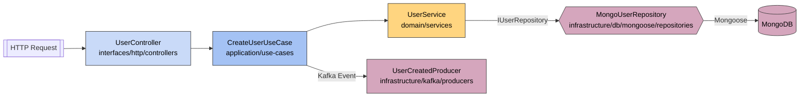

# `Agents.md` – Standards & TypeScript Stubs for **Clean‑Architecture Node.js + TypeScript** Projects

This guide defines a **single, opinionated playbook** for architecture, naming, folder layout, testing, linting, and code stubs so that human developers *and* AI agents (Codex, Copilot, etc.) can collaborate on any Node.js + TypeScript repository in a predictable, maintainable way.

---

## 1  Folder Structure (Clean / Hexagonal)

| Layer / Adapter                   | Path (`src/...`)                        | **Interfaces / Contracts**                    | **Concrete Implementations**                                      | Notes                                                                  |
| --------------------------------- | --------------------------------------- | --------------------------------------------- | ----------------------------------------------------------------- | ---------------------------------------------------------------------- |
| **Domain**                        | `domain/`                               | Entities, **repository & service interfaces** | –                                                                 | Pure business rules; *never* import Express, Mongoose, KafkaJS, axios… |
| └─ Entities                       | `domain/entities/`                      | `User.ts`, `Question.ts`…                     | –                                                                 | Value objects & aggregates                                             |
| └─ Repositories                   | `domain/repositories/`                  | `IUserRepository.ts`…                         | –                                                                 | CRUD contracts only                                                    |
| └─ Services                       | `domain/services/`                      | `IUserService.ts`…                            | –                                                                 | Stateless domain services                                              |
| **Application**                   | `application/`                          | (optional) use‑case interfaces                | **Use‑case classes** (`CreateUserUseCase.ts`)                     | Orchestrates domain logic                                              |
| **Interfaces (Ports)**            | `interfaces/`                           | –                                             | Adapters that talk **to or from** the outside world               | Never import infra libs                                                |
| └─ HTTP (Ingress)                 | `interfaces/http/`                      | –                                             | `controllers/`, `routes/`, `middleware/`                          | Express/Fastify only                                                   |
| └─ Messaging (Ingress)            | `interfaces/messaging/consumers/`       | –                                             | Kafka/Rabbit consumers                                            | Consume & call use‑cases                                               |
| └─ External Services (Egress)     | `interfaces/external-services/clients/` | –                                             | HTTP/GRPC clients                                                 | Call 3rd‑party APIs                                                    |
| **Infrastructure (Adapters Out)** | `infrastructure/`                       | –                                             | Concrete technology that **implements** domain contracts          | Only layer that may import Mongoose/KafkaJS/etc.                       |
| └─ DB (Mongo)                     | `infrastructure/db/mongoose/`           | –                                             | `schemas/`, `models/`, `repositories/` (`MongoUserRepository.ts`) | Implements `IUserRepository`                                           |
| └─ Kafka Producers                | `infrastructure/kafka/producers/`       | –                                             | `UserCreatedProducer.ts` …                                        | Publishes domain events                                                |
| └─ Config / DI                    | `infrastructure/config/`                | DI container contracts                        | env loaders, factories                                            | Composition helpers                                                    |
| **Contracts**                     | `contracts/`                            | –                                             | `openapi.yaml`, `asyncapi.yaml`                                   | Must mirror code                                                       |
| **Bootstrap**                     | `main.ts`                               | –                                             | App wiring & server start                                         | Composition root                                                       |
| **Tests**                         | `tests/`                                | Interface mocks                               | unit + integration tests                                          | Mirror `src/`                                                          |

> **Rule of thumb:** *Interfaces live in `domain/` (or occasionally `application/`) and **only** their concrete implementations live in `infrastructure/`.* Ingress adapters (controllers, consumers) **never** talk directly to infrastructure—only through use‑cases and interfaces.

---

## 2  Artifact‑to‑Folder Cheat‑Sheet

| Artifact                        | Folder                                                                  | File Example                        |
| ------------------------------- | ----------------------------------------------------------------------- | ----------------------------------- |
| **Express Controller**          | `interfaces/http/controllers/`                                          | `user.controller.ts`                |
| **Route Table**                 | `interfaces/http/routes/`                                               | `user.routes.ts`                    |
| **Kafka Consumer**              | `interfaces/messaging/consumers/`                                       | `user-created.consumer.ts`          |
| **Kafka Producer**              | `infrastructure/kafka/producers/`                                       | `user-created.producer.ts`          |
| **Domain Entity**               | `domain/entities/`                                                      | `user.entity.ts`                    |
| **Domain Repository Interface** | `domain/repositories/`                                                  | `user.repository.interface.ts`      |
| **Repository Implementation**   | `infrastructure/db/mongoose/repositories/`                              | `mongo-user.repository.ts`          |
| **Domain Service Interface**    | `domain/services/`                                                      | `notification.service.interface.ts` |
| **Service Implementation**      | `infrastructure/services/` *or* `interfaces/external-services/clients/` | `sendgrid-notification.service.ts`  |
| **Application Use‑Case**        | `application/use-cases/`                                                | `create-user.use-case.ts`           |
| **DTO / Mapper**                | `application/dto/`, `application/mappers/`                              | `create-user.dto.ts`                |
| **DI Factory**                  | `infrastructure/config/factories/`                                      | `user.controller.factory.ts`        |
| **OpenAPI / AsyncAPI**          | `contracts/`                                                            | `openapi.yaml`                      |

---

## 3  Interfaces vs. Implementations — Golden Rules

1. **Interfaces first.** Declare the contract in `domain/`.
2. **Implementations later** in `infrastructure/`.
3. Controllers/consumers depend **only** on use‑cases.
4. Use‑cases depend **only** on injected *interfaces*.
5. **Only infrastructure** touches external libraries and fulfills the contracts.

---

## 4  Sample Wiring Flow (colours = layer)



---

## 5  Naming Conventions

### 5.1 Interfaces & Enums

| Type                                  | Prefix | Casing | Example                         |
| ------------------------------------- | ------ | ------ | ------------------------------- |
| **Domain interface**                  | `I`    | Pascal | `IUser`, `IOrderService`        |
| **Persistence interface** (Mongo doc) | `IM`   | Pascal | `IMUser`                        |
| **Enum**                              | `E`    | Pascal | `EStatus` (`ACTIVE`, `PENDING`) |

*Classes / functions* → PascalCase or camelCase.<br>*Constants* → `UPPER_SNAKE_CASE`.

### 5.2 `IM*` Pattern

```ts
export interface IMUser extends IUser {
  _id: Types.ObjectId;
  createdAt: Date;
  updatedAt: Date;
}
```

Use in `Schema<IMUser>` and `model<IMUser>("User", UserSchema)`.

---

## 6  Code Stubs

### 6.1 Domain – Entity & Repository Contract

```ts
// domain/entities/user.entity.ts
export interface IUser { id: string; name: string; email: string; }

// domain/repositories/user.repository.interface.ts
export interface IUserRepository {
  findById(id: string): Promise<IUser | null>;
  create(user: IUser): Promise<void>;
}
```

### 6.2 Mongoose Schema & Model (Infrastructure)

```ts
// infrastructure/db/mongoose/schemas/user.schema.ts
export const UserSchema = new Schema<IMUser>({
  name : { type: String, required: true },
  email: { type: String, required: true, unique: true },
},{ timestamps: true });

// infrastructure/db/mongoose/models/user.model.ts
export const UserModel = model<IMUser>("User", UserSchema);
```

### 6.3 External HTTP Service (Interface + Impl.)

```ts
// domain/services/auth.external-service.interface.ts
export interface IAuthExternalService {
  validateToken(token: string): Promise<IUser | null>;
}

// interfaces/external-services/clients/auth.external.service.ts
export class AuthExternalService implements IAuthExternalService {
  async validateToken(token: string) {
    return httpClient.post(`${AUTH_API}/validate`, { token });
  }
}
```

### 6.4 Messaging (Kafka Producer)

```ts
// infrastructure/kafka/producers/user-created.producer.ts
export class UserCreatedProducer {
  async publish(user: IUser) {
    await kafkaProducer.produce({
      topic: "user.events",
      key  : user.id,
      value: JSON.stringify({ type: "USER_CREATED", data: user }),
    });
  }
}
```

---

## 7  Controller Pattern & OpenAPI Compliance

* Controllers live in `interfaces/http/controllers` → extract request → call use‑case → map response.
* **No** business logic in controllers.
* **Every** route must be documented in `contracts/openapi.yaml` (params, schemas, examples, `operationId`).

---

## 8  Dependency Injection & Bootstrapping

```ts
export class UserServiceFactory {
  static create(): IUserService {
    return new UserService({
      userRepository      : new MongoUserRepository(),
      userCreatedProducer : new UserCreatedProducer(),
    });
  }
}
```

`main.ts` connects DB → starts HTTP → starts background workers. **No side‑effects at module load time.**

---

## 9  Testing & Linting Standards

| Tool         | Purpose                 | Command              |
| ------------ | ----------------------- | -------------------- |
| **Jest**     | unit + integration      | `yarn test`          |
| **Coverage** | ≥ 80 % lines & branches | `yarn test:coverage` |
| **ESLint**   | Airbnb + TS rules       | `yarn lint`          |
| **Prettier** | formatting              | `yarn format`        |

CI must fail if coverage or linting is below the threshold.

---

## 10  Codex Contribution Checklist ✅

1. **Naming & Files** — use `I*`, `IM*`, `E*`; put files in the correct folders.
2. **Architecture** — keep controllers thin, use DI everywhere.
3. **Quality** — tests ≥ 80 %, ESLint & Prettier pass.
4. **Docs** — keep OpenAPI / AsyncAPI synchronized with code.

---

## 11  Messaging Producer Checklist (Kafka)

1. Create *interface + implementation* under the correct folders.
2. Inject the producer via the service constructor.
3. Register the implementation in its factory.
4. Call the producer **after** repository operations.
5. Add a spy integration test that ensures the producer fires with the correct payload.

---

## 12  Layer Responsibilities & Route Conventions

* **Controller** – adapt HTTP ↔ use‑case.
* **Service / Use‑Case** – business rules, idempotency.
* **Repository** – thin CRUD wrappers; rely on DB constraints.
* **Route naming** – `/resource-name/action` (kebab‑case).
* **Avoid** generic names (e.g., `mapFunction`).

---

## 13  Strict Interface & Typing Rules

* Repositories & services **must** return typed interfaces — never `any`.
* 👉 **No `typeof`‑based ad‑hoc types**; define interfaces explicitly.
* Always reuse existing interfaces before creating new ones.

```ts
export interface IQuestionRepository {
  findByEid(eid: string): Promise<IQuestion | null>;
}
```

### Why?

* Safer refactors; compile‑time guarantees.
* Clear contracts between layers (controller → use‑case → repo).
* Helps AI code tools reason about your structures.

---
