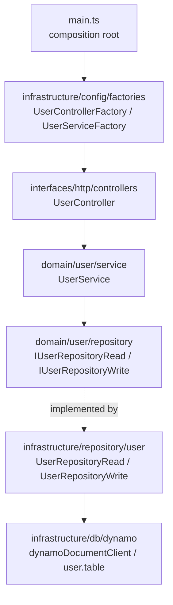
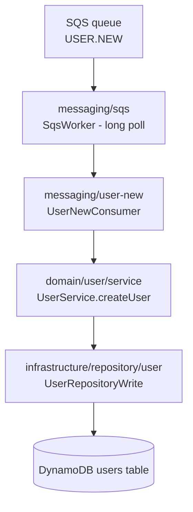

# Architecture

## Overview

Clean Architecture with vertical slices per feature. The `user` slice is the
canonical example — every new feature must mirror it file by file.



**Dependency rule:** `domain/` is pure — it does not import `infrastructure/`
or `interfaces/`. Repository contracts live in the domain
(`src/domain/user/repository/user.repository.read.ts` → `IUserRepositoryRead`);
implementations live in infrastructure
(`src/infrastructure/repository/user/user.repository.read.ts` → `UserRepositoryRead`).
The **file names are identical** on both sides — the directory distinguishes
contract from implementation. Do not mix them up when editing.

## Read/write split (light CQRS)

Each feature has two repository contracts:

- `I<Feature>RepositoryRead` — `findUserById`, `findUserByEmail`, `listUsers`
- `I<Feature>RepositoryWrite` — `createUser`, `updateUserById`, `deleteUserById`

The service receives both via a parameter object:

```ts
export class UserService implements IUserService {
  private userRepositoryRead: IUserRepositoryRead;
  private userRepositoryWrite: IUserRepositoryWrite;

  constructor({ userRepositoryRead, userRepositoryWrite }: IParamsUserService) {
    this.userRepositoryRead = userRepositoryRead;
    this.userRepositoryWrite = userRepositoryWrite;
  }
}
```

## Dependency injection

Manual DI, no container. Static factories in
`src/infrastructure/config/factories/`, one per artifact, with a `static create()`:

```ts
// user.service.factory.ts
export class UserServiceFactory {
  static create() {
    return new UserService({
      userRepositoryRead: new UserRepositoryRead(),
      userRepositoryWrite: new UserRepositoryWrite(),
    });
  }
}

// user.controller.factory.ts
export class UserControllerFactory {
  static create(): IController {
    return new UserController(UserServiceFactory.create());
  }
}
```

Rules:

1. All composition happens in factories — never inside services/controllers.
2. Factories do **no I/O at module load**; side effects only inside `create()`.
3. `main.ts` only knows controller factories.

## Server lifecycle (`src/interfaces/http/server.ts`)

Initialization order in the `Server` constructor:

1. `/health` route (registered **before** the middlewares — which is why it escapes the OpenApiValidator).
2. Middlewares: `express.json({ limit: '3mb' })` → `express.urlencoded` →
   `ContextAsyncHooks.getExpressMiddlewareTracking()` (traceability cid) → `helmet()` →
   extra middlewares passed via `middlewaresToStart` in the constructor.
3. `OpenApiValidator.middleware` with `validateApiSpec: true` and `validateResponses: true`.
4. Controller routes (`controller.getRoutes()` mounted at `/`).
5. **Central error handler** (`errorHandler()`): the only place that translates
   errors into HTTP responses — `DomainError` → `err.status` + `{ message, status }`;
   validator `HttpError` → `{ message, status, errors }`; generic `Error` →
   structured log + 500 `{ message: 'Internal Server Error', status: 500 }`.

In `main.ts`, the boot order is: telemetry (first-line import) → env validation
(`infrastructure/config/env.ts`, fail-fast) → `new Server(...)` →
`await databaseSetup()` → `listen()` → graceful-shutdown registration
(SIGTERM/SIGINT close the HTTP server and the DynamoDB client, exit 0 on
success, with a failsafe timeout).

The `Server` receives an `IDatabase` adapter
(`src/infrastructure/db/database.interface.ts`) instead of a connection string:
`DynamoDatabase` (`src/infrastructure/db/dynamo/dynamo.database.ts`) ensures
the tables exist on `start()` (idempotent — in production they are usually
provisioned by IaC) and destroys the client on `close()`.

## Domain errors (`src/domain/errors/`)

`DomainError` (base, carries the HTTP `status`) and the specializations
`BadRequestError` (400), `NotFoundError` (404) and `ConflictError` (409).
The error flow is always:
service throws a typed error → controller passes it on with `next(error)` →
central error handler responds in the contract shape. No other layer builds
error responses.

## Request→response flow (example: `POST /users`)

1. `express.json` parses the body; `ContextAsyncHooks` creates the tracking context (cid); OTel auto-instrumentation opens the HTTP span.
2. `OpenApiValidator` validates the request against `src/contracts/service.yaml` — an invalid body → 400 `ValidationError` before reaching the controller.
3. `UserController.createUser` (arrow function property) extracts `{ id, name, email, createdAt }` from the body and calls `userService.createUser(...)`.
4. `UserService.createUser` applies the business rule: email already in use → throws `ConflictError` (becomes 409 in the handler); otherwise builds the `User` entity and delegates to `userRepositoryWrite.createUser`.
5. `UserRepositoryWrite` persists via a `PutCommand` on the users table and returns a plain `IUser` (the `toUser` mapper in `user.table.ts` picks fields explicitly, so storage internals never leak).
6. The controller responds `201` with the user; any error goes to `next(error)`.
7. `OpenApiValidator` validates the **response** against the contract before sending it.

`GET /users` uses cursor pagination: `limit`/`cursor` query params (validated
and coerced by the contract), forwarded by the controller to the service, which
applies the default limit (20) and passes an `IPagination` to the repository.
The repository resumes the scan from the decoded cursor (`ExclusiveStartKey`),
fills the page (paging past filtered-out items) and returns
`IPaginatedResult<IUser>` — `{ items, nextCursor }`, where `nextCursor` is the
last returned item's key encoded as an opaque base64url token
(`dynamo.cursor.ts`). A malformed cursor throws `BadRequestError` (400).

## Message flow (SQS `USER.NEW`)



1. `SqsWorker` (generic long-poller, `src/infrastructure/messaging/sqs/sqs.worker.ts`) receives up to 10 messages per poll requesting the tracking MessageAttributes (`traceparent`, `tracestate`, `cid`).
2. `UserNewConsumer` re-establishes the tracking context **before anything else**: `ContextAsyncHooks.asyncLocalStorage.run({ cid }, ...)` plus `propagation.extract` + a CONSUMER span — every log down the chain carries `cid`/`trace_id` and the DynamoDB spans are children of the message trace.
3. The payload is validated (`parseUserNewPayload` → `BadRequestError` on invalid input) and delegated to `UserService.createUser` — the **same business rules** as `POST /users` (email conflict → `ConflictError`).
4. The consumer returns a delivery decision; the worker owns the queue semantics:

| Outcome | Decision | Queue effect |
| --- | --- | --- |
| Created | `ack` | `DeleteMessageCommand` |
| Invalid payload (`BadRequestError`) | `ack` + warn | Deleted — redelivery can never fix it |
| Duplicate (`ConflictError` / `ConditionalCheckFailedException`) | `ack` + warn | Deleted — idempotent replay |
| Unknown error | `retry` + error | Left on queue → visibility timeout → redrive policy → DLQ |

The redrive policy (`maxReceiveCount` → DLQ) is infrastructure configuration; the application never tracks receive counts. Boot order is telemetry → env → database → HTTP → worker; shutdown stops the worker **first** (drains the in-flight batch), then closes the HTTP server and the database. The message contract lives in `src/contracts/asyncapi.yaml`.

## OpenAPI contract (`src/contracts/service.yaml`)

- Source of truth for the API; validated at runtime in both directions.
- Every route/payload change **requires** updating the yaml in the same PR.
- The build copies the yaml to `dist/src/contracts` via the `copy-essentials`
  script (tsc does not copy non-TS files). Without it, `yarn start` breaks.
- Routes not documented in the contract are rejected by the validator.

## Entry points

| File | Role |
| --- | --- |
| `src/main.ts` | Production/dev: telemetry + `Server` + controllers via factories + `UserNewWorkerFactory` (SQS worker) |
| `src/__tests__/configApp.ts` | `Server` instance used by integration tests — **must register the same controllers** |
