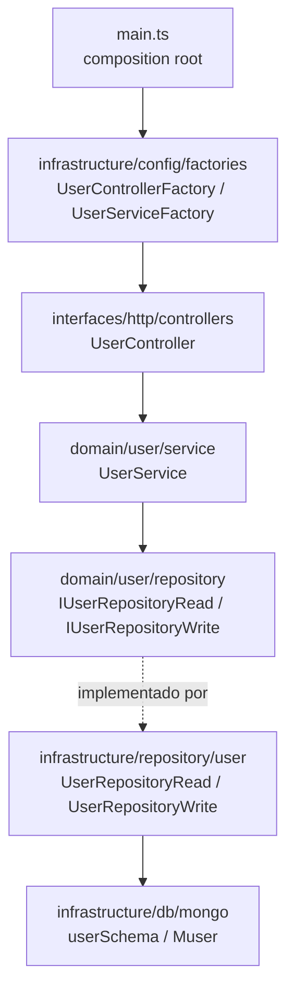

# Arquitetura

## Visão geral

Clean Architecture com *vertical slices* por feature. O slice `user` é o exemplo
canônico — toda nova feature deve espelhá-lo arquivo a arquivo.



**Regra de dependência:** `domain/` é puro — não importa `infrastructure/` nem
`interfaces/`. Os contratos de repositório vivem no domínio
(`src/domain/user/repository/user.repository.read.ts` → `IUserRepositoryRead`);
as implementações vivem na infraestrutura
(`src/infrastructure/repository/user/user.repository.read.ts` → `UserRepositoryRead`).
Os **nomes de arquivo são idênticos** nos dois lados — o diretório diferencia
contrato de implementação. Não confundir ao editar.

## Read/Write split (CQRS leve)

Cada feature tem dois contratos de repositório:

- `I<Feature>RepositoryRead` — `findUserById`, `findUserByEmail`, `listUsers`
- `I<Feature>RepositoryWrite` — `createUser`, `updateUserById`, `deleteUserById`

O service recebe ambos via objeto de parâmetros:

```ts
export class UserService implements IUserService {
  private userRepositoryRead: IUserRepositoryRead;
  private userRepositoryWrite: IUserRepositoryWrite;

  constructor({ userRepositoryRead, userRepositoryWrite }: IParamsUserService) {
    this.userRepositoryRead = userRepositoryRead;
    this.userRepositoryWrite = userRepositoryWrite;
  }
}
```

## Injeção de dependência

DI manual, sem container. Factories estáticas em
`src/infrastructure/config/factories/`, uma por artefato, com método `static create()`:

```ts
// user.service.factory.ts
export class UserServiceFactory {
  static create() {
    return new UserService({
      userRepositoryRead: new UserRepositoryRead(),
      userRepositoryWrite: new UserRepositoryWrite(),
    });
  }
}

// user.controller.factory.ts
export class UserControllerFactory {
  static create(): IController {
    return new UserController(UserServiceFactory.create());
  }
}
```

Regras:

1. Toda composição acontece nas factories — nunca dentro de services/controllers.
2. Factories **não fazem I/O em module load**; efeitos colaterais só dentro de `create()`.
3. `main.ts` só conhece factories de controller.

## Ciclo de vida do Server (`src/interfaces/http/server.ts`)

Ordem de inicialização no construtor de `Server`:

1. Rota `/health` (registrada **antes** dos middlewares — por isso escapa do OpenApiValidator).
2. Middlewares: `express.json({ limit: '3mb' })` → `express.urlencoded` →
   `ContextAsyncHooks.getExpressMiddlewareTracking()` (cid do traceability) → `helmet()` →
   middlewares extras passados via `middlewaresToStart` no construtor.
3. `OpenApiValidator.middleware` com `validateApiSpec: true` e `validateResponses: true`.
4. Rotas dos controllers (`controller.getRoutes()` montadas em `/`).
5. **Error handler central** (`errorHandler()`): único ponto que traduz erros em
   respostas HTTP — `DomainError` → `err.status` + `{ message, status }`;
   `HttpError` do validator → `{ message, status, errors }`; `Error` genérico →
   log estruturado + 500 `{ message: 'Internal Server Error', status: 500 }`.

Em `main.ts`, a ordem de boot é: telemetria (import na 1ª linha) → validação de env
(`infrastructure/config/env.ts`, fail-fast) → `new Server(...)` →
`await databaseSetup()` → `listen()` → registro de graceful shutdown
(SIGTERM/SIGINT fecham HTTP server e Mongoose, com timeout de segurança).

## Erros de domínio (`src/domain/errors/`)

`DomainError` (base, carrega o `status` HTTP) e as especializações `NotFoundError`
(404) e `ConflictError` (409). O fluxo de erro é sempre:
service lança erro tipado → controller repassa com `next(error)` → error handler
central responde no formato do contrato. Nenhuma outra camada monta resposta de erro.

## Fluxo request→response (exemplo: `POST /users`)

1. `express.json` faz o parse do body; `ContextAsyncHooks` cria o contexto de tracking (cid); a auto-instrumentação OTel abre o span HTTP.
2. `OpenApiValidator` valida o request contra `src/contracts/service.yaml` — body inválido → 400 `ValidationError` antes de chegar ao controller.
3. `UserController.createUser` (arrow function property) extrai `{ id, name, email, createdAt }` do body e chama `userService.createUser(...)`.
4. `UserService.createUser` aplica regra de negócio: email já em uso → lança `ConflictError` (vira 409 no handler); senão delega ao `userRepositoryWrite.createUser`.
5. `UserRepositoryWrite` persiste via model `Muser` e devolve um `IUser` puro (projeção esconde `_id`/`__v` — ver `mongo.projection.ts`).
6. Controller responde `201` com o usuário; qualquer erro vai para `next(error)`.
7. `OpenApiValidator` valida a **response** contra o contrato antes de enviá-la.

## Contrato OpenAPI (`src/contracts/service.yaml`)

- Fonte de verdade da API; validado em runtime nos dois sentidos.
- Toda mudança de rota/payload **exige** atualizar o yaml no mesmo PR.
- O build copia o yaml para `dist/src/contracts` via script `copy-essentials`
  (o tsc não copia arquivos não-TS). Sem isso, `yarn start` quebra.
- Rotas não documentadas no contrato são rejeitadas pelo validator.

## Entry points

| Arquivo | Papel |
| --- | --- |
| `src/main.ts` | Produção/dev: telemetria + `Server` + controllers via factories |
| `src/__tests__/configApp.ts` | Instância de `Server` usada nos testes de integração — **precisa registrar os mesmos controllers** |
